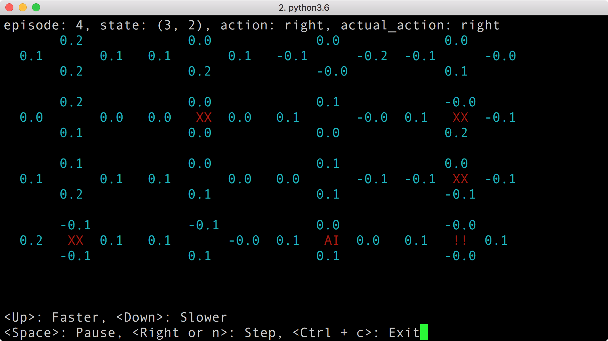
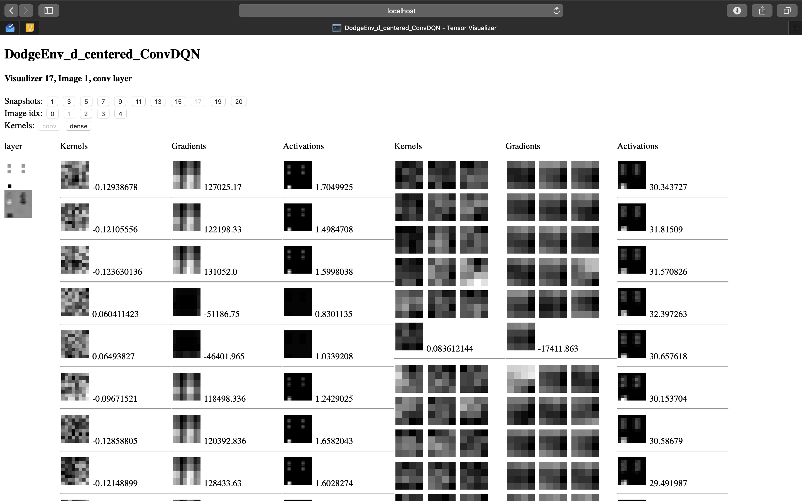
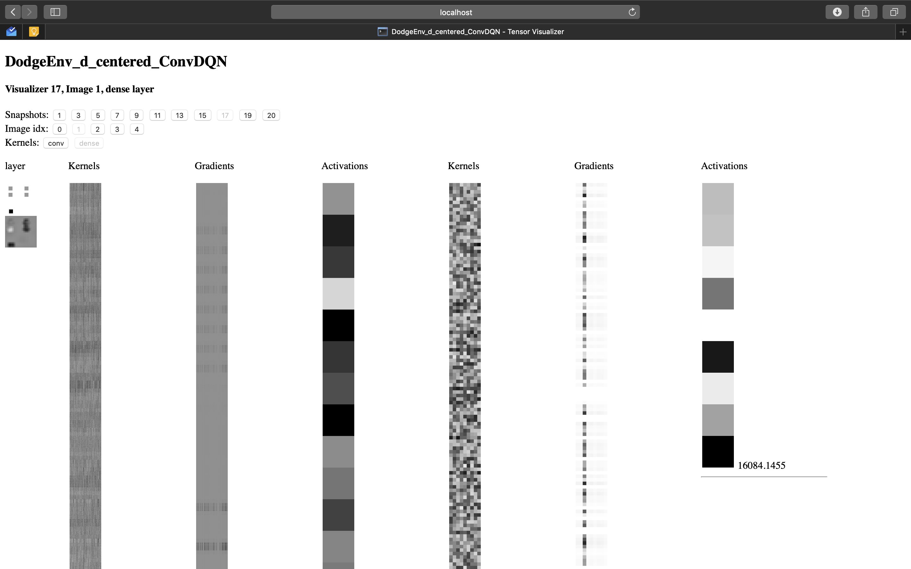
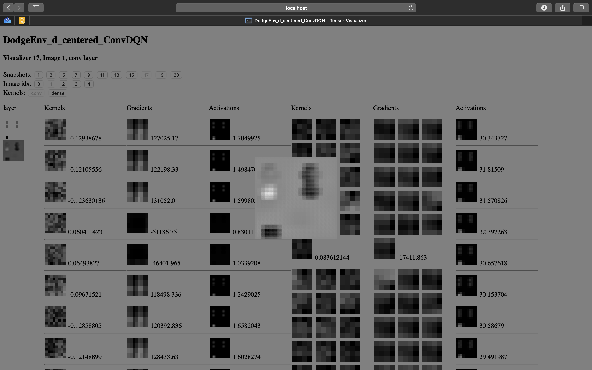

## What this is ##

This section illustrates several reinforcement learning techniques with comments explaining implementation details.
Most of the ideas are from [here](#credits--references).
I used my own implementation of FrozenLake environment(env.py) instead of OpenAI Gym to illustrate the entire situation more comprehensively and add some tweaks to make model converge.

### Milestones ###

- [x] Q-Learning
  - [x] Deterministic / Stochastic
- [x] Deep Q-Learning
  - [x] Deterministic / Stochastic
- [ ] Policy Gradient
  - [x] Deterministic
  - [ ] Stochastic

## Usage ##
### Train ###
```
# python main.py -h
usage: main.py [-h] [-i] [--env_mode {d,s}] [--train {q,dqn,pg}]

optional arguments:
  -h, --help          show this help message and exit
  -i                  Enable interactive mode
  --env_mode {d,s}    Whether the environment is stochastic or deterministic
  --train {q,dqn,pg}  Training method
```

Interactive mode shows you what's going on inside the training session.\


### Visualize ###
```
# python visualizer_server.py
```

Visualizer shows kernels, gradients and activations for each layers per snapshot.
Run the command above and open http://localhost:5000/[NETWORK_ID] on your browser. It will take a while, so be patient.
Once it's loaded, you can easily navigate through each snapshots, inputs, and kernel types of the network by clicking each snapshot buttons.

Each layers are represented with 3 columns(kernels, gradients, and activations).
Images are normalized to show how significant each images(filters/gradients/activations) are, respect to columns they're in(kernel, gradient, activation). Numbers on the right shows mean values for each filters/kernels. Click each image to see in detail.

The architecture used for the preview images below is:
- Convolution 1:  16 8x8x1 filters
- Convolution 2:  32 4x4x16 filters
- Dense 1:        3200x256 kernel
- Dense 2:        256x4 kernel

Visualizer currently only supports dqn.

\
\


## Credits & References ##
- Sung Kim's RL lecture
  - Lecture: http://hunkim.github.io/ml/
  - Source: https://github.com/hunkim/ReinforcementZeroToAll

- Andrej Karpathy's Implementation of Policy Gradient on Pong
  - Presentation: https://www.youtube.com/watch?v=tqrcjHuNdmQ&t=1403s
  - Explanation Post: http://karpathy.github.io/2016/05/31/rl/
  - Source: https://gist.github.com/karpathy/a4166c7fe253700972fcbc77e4ea32c5

- Playing Atari with Deep Reinforcement Learning
  - Paper: https://www.cs.toronto.edu/~vmnih/docs/dqn.pdf

## Contributions ##
Contributions in any shape or form will be welcomed 🤘
